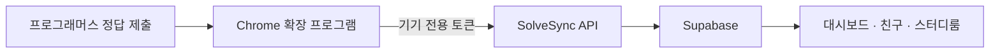

# SolveSync

> 푸는 순간 기록되고, 함께라서 꾸준해지는 코딩테스트 스터디 플랫폼

SolveSync(솔브싱크)는 프로그래머스 풀이 기록을 자동으로 모으고, 친구와 스터디 멤버가 함께 목표를 이어갈 수 있도록 만든 서비스입니다.

문제를 풀 때마다 기록을 따로 옮길 필요가 없습니다. Chrome 확장 프로그램이 정답 제출을 감지해 풀이를 저장하고, SolveSync는 그 기록을 대시보드와 스터디 진행 현황에 바로 반영합니다.

**서비스 바로가기:** [solve-sync.vercel.app](https://solve-sync.vercel.app)

## 주요 기능

- **풀이 자동 기록** — 프로그래머스에서 정답을 제출하면 문제, 난이도, 언어, 풀이 시각과 소요 시간을 자동으로 저장합니다.
- **성장 대시보드** — 누적 풀이와 최근 활동, 기여 그래프로 알고리즘 학습 흐름을 확인합니다.
- **유형별 랭킹** — 알고리즘과 SQL 점수를 각각 산출하고 `알고리즘 점수 + SQL 점수 / 2`로 순위를 계산합니다.
- **친구 연결** — 고유한 `@핸들`로 사용자를 찾고 친구 요청을 주고받습니다.
- **스터디룸** — 일간 또는 주간 목표와 최소 문제 난이도를 정하고 멤버별 달성 현황을 함께 확인합니다.
- **공개·비공개 스터디** — 누구나 참여하는 공개방과 비밀번호로 보호되는 비공개방을 만들 수 있습니다.
- **스터디 라운지** — 같은 스터디의 멤버들과 댓글을 남기고 실시간으로 대화합니다.
- **스터디 푸시 알림** — 방별로 알림을 켜면 목표 마감 6시간 전 미달성 알림을 받고, 함께 알림을 켠 멤버끼리 ‘콕 찌르기’를 보낼 수 있습니다.
- **앱 내 알림함** — 목표 마감, 목표 미달과 ‘콕 찌르기’를 한곳에서 확인하고 읽음 상태를 관리합니다.
- **오늘의 풀이왕** — 스터디룸에서 그날 가장 많이 푼 멤버를 동점까지 함께 보여줍니다.

## 이용 방법

### 1. 계정 만들기

SolveSync에 접속해 **Google로 계속하기**를 누릅니다. 처음 로그인하면 친구 검색과 스터디 활동에 사용할 고유 핸들을 설정합니다.

핸들은 영문 소문자, 숫자, 밑줄을 사용해 3~20자로 만들 수 있습니다.

### 2. Chrome 확장 프로그램 설치하기

Chrome 웹 스토어에서 [SolveSync 확장 프로그램](https://chromewebstore.google.com/detail/solvesync/dgghaooaokpafdhjgieajelgbilacmkd?hl=ko&utm_source=ext_sidebar)을 설치합니다.

1. 웹 스토어 페이지에서 **Chrome에 추가**를 누릅니다.
2. 권한 확인 창에서 **확장 프로그램 추가**를 누릅니다.
3. Chrome 도구 모음의 퍼즐 아이콘을 열고 SolveSync를 고정합니다.

설치가 끝나면 Chrome 도구 모음에 SolveSync 확장 프로그램을 고정해두면 편리합니다.

### 3. SolveSync 계정과 연결하기

1. Chrome에서 SolveSync 확장 프로그램을 엽니다.
2. **SolveSync 계정 연결**을 누르고 서버 통신 권한 요청을 허용합니다.
3. 열린 SolveSync 화면에서 Google로 로그인합니다.
4. 표시된 기기를 확인하고 **이 기기 연결 승인**을 누릅니다.
5. 연결 창이 닫히면 확장 프로그램에서 연결 상태를 확인합니다.

토큰을 복사하거나 붙여 넣을 필요가 없습니다. Windows 노트북, 데스크톱, Mac 등 각 기기에서 위 과정을 한 번씩 실행하면 모든 풀이가 같은 SolveSync 계정으로 모입니다. 기기마다 별도 토큰을 사용하므로 마이페이지에서 한 기기만 해제해도 다른 기기의 연결은 유지됩니다.

정답 기록은 서버 전송 전에 확장 프로그램의 로컬 대기열에 먼저 보관됩니다. 네트워크 또는 인증 문제로 즉시 전송하지 못한 기록은 자동으로 다시 전송되며, 확장 프로그램 팝업에서 대기 건수와 최근 오류를 확인하거나 **지금 동기화**를 실행할 수 있습니다.

### 4. 프로그래머스 문제 풀기

평소처럼 프로그래머스에서 문제를 풀고 코드를 제출합니다. 제출 결과가 정답이면 확장 프로그램이 풀이 정보를 SolveSync로 전송합니다.

웹의 **계정에 등록된 기기**는 다른 브라우저에서 연결한 기기까지 포함하며, **현재 브라우저: 연결됨**은 지금 사용하는 확장 프로그램이 로그인한 계정에 연결되어 있음을 뜻합니다. 연동 안내와 마이페이지에서 상세 상태를 확인할 수 있고, **다시 확인**을 누르거나 탭으로 돌아오면 상태와 등록된 기기 목록을 다시 조회합니다. 연결을 마친 뒤 첫 기록이 도착하면 대시보드에 풀이가 누적됩니다. 같은 문제를 다시 풀어도 한 문제는 하나의 기록으로 관리됩니다.

### 5. 친구와 함께하기

**친구** 메뉴에서 상대방의 핸들을 검색해 친구 요청을 보냅니다. 상대방이 요청을 수락하면 친구 목록에 연결됩니다.

### 6. 스터디룸 참여하기

**스터디** 메뉴에서 공개된 스터디룸을 둘러보거나 직접 새 방을 만듭니다.

- 목표 주기를 `매일` 또는 `매주`로 설정할 수 있습니다.
- 목표에 반영할 최소 문제 난이도를 `0단계 이상`부터 `5단계 이상`까지 설정할 수 있습니다.
- 비공개방은 8자 이상의 비밀번호로 보호됩니다.
- 스터디 멤버의 목표 달성 현황과 풀이 수를 함께 확인할 수 있습니다.
- 알고리즘과 SQL 풀이가 모두 스터디 목표에 반영됩니다.
- 라운지에서 멤버들과 학습 상황이나 문제 풀이 이야기를 나눌 수 있습니다.

## 동작 방식



기기 연결 시 PKCE와 5분 유효 일회용 승인 코드를 사용하며, 장기 토큰은 URL에 노출하지 않습니다. 기기 전용 토큰은 원문 대신 SHA-256 해시로 저장합니다. 브라우저에서 사용하는 Supabase Publishable Key와 서버 전용 Secret Key를 분리하고, 사용자 데이터 접근은 PostgreSQL Row Level Security로 제한합니다.

## 로컬에서 실행하기

### 준비물

- Node.js 20 이상
- npm
- Supabase 프로젝트
- Google OAuth 클라이언트

### 1. 저장소 설치

```bash
git clone https://github.com/ggwanrok/solve-sync.git
cd solve-sync
npm install
```

### 2. Supabase 데이터베이스 구성

새 Supabase 프로젝트를 만든 뒤 Dashboard의 **SQL Editor**에서 `supabase/schema.sql` 전체를 실행합니다. 이 파일에는 테이블, 함수, 트리거, RLS 정책과 권한 설정이 포함되어 있습니다.

기존 데이터베이스를 업데이트하는 경우 다중 기기 연결을 위해 먼저 `supabase/extension-multi-device.sql`을 실행하고, 계정당 연결을 5개로 제한하려면 `supabase/extension-connection-limit.sql`을 이어서 실행합니다. 익스텐션에서 문제 난이도와 알고리즘/SQL 유형을 저장하려면 `supabase/solve-event-difficulty.sql`, `supabase/solve-event-problem-type.sql`을 차례로 실행합니다. 문제 메모 항목을 간소화하려면 `supabase/simplify-problem-memos.sql`을 실행하고, 항목별 글자 수 제한에는 `supabase/problem-memo-length-limits.sql`, 풀이 성공 후 메모 열기 설정에는 `supabase/problem-memo-prompt.sql`을 이어서 실행합니다. 스터디룸 성능 개선을 적용하려면 `supabase/study-room-directory-pagination.sql`과 `supabase/study-room-detail-performance.sql`을 순서대로 실행한 뒤, 난이도 목표 기능을 위한 `supabase/study-difficulty-filter.sql`과 목록 필터를 위한 `supabase/study-directory-filters.sql`을 차례대로 실행합니다. 친구 삭제와 프로필 사진 저장소를 추가하려면 `supabase/profile-management.sql`을 실행하고, 친구 잔디 조회에는 `supabase/friend-contributions.sql`, 보낸 친구 요청 취소에는 `supabase/cancel-friend-request.sql`을 실행합니다. 프로필 한 줄 소개와 전체 랭킹 집계를 적용하려면 `supabase/profile-bio.sql`, `supabase/dashboard-ranking.sql` 순서로 실행합니다. 스터디 푸시 알림에는 `supabase/study-push-notifications.sql`을 실행하며, 기존 설치의 콕 재전송 제한을 10분으로 바꾸고 목표 달성자 제한을 없애려면 `supabase/study-poke-cooldown.sql`을 추가로 실행합니다. 앱 내 알림함과 오늘의 풀이왕에는 `supabase/in-app-study-notifications.sql`을 실행하고, 풀이왕을 목표 조건과 분리하려면 `supabase/study-daily-champion-independent-of-goal.sql`을 이어서 실행합니다. 목표 알림을 오후 6시, 목표 미달 알림을 다음 오전 6시에 분리하려면 `supabase/study-notification-schedule.sql`을 실행하고, 기존 설치에서 기간 정리 알림을 중단하려면 `supabase/remove-study-period-summary.sql`을 이어서 실행합니다. 그 밖의 필요한 기능 SQL을 적용한 다음 `supabase/security-hardening.sql`을 마지막에 실행합니다. 스터디 라운지 메시지를 실시간으로 동기화하려면 `supabase/study-comments-realtime.sql`을 실행합니다.

기존 DB에서 SQL 풀이를 스터디 집계에 포함하고 유형별 랭킹 산식을 적용하려면 `supabase/solve-event-problem-type.sql` 적용 후 `supabase/study-difficulty-filter.sql`, `supabase/dashboard-ranking.sql`을 순서대로 다시 실행합니다. 랭킹 산식은 유형별로 난이도 상위 100문제와 풀이 보너스를 독립 계산한 뒤 `알고리즘 점수 + (SQL 점수 / 2)`를 최종 점수로 사용하며, SQL 점수 나눗셈의 소수점은 버립니다.

### 3. Google 로그인 구성

1. Supabase Dashboard의 **Authentication → Providers → Google**에서 Google 공급자를 활성화합니다.
2. Google OAuth Client ID와 Client Secret을 등록합니다.
3. Google Cloud Console의 승인된 리디렉션 URI에 다음 주소를 추가합니다.

```text
https://<your-project-ref>.supabase.co/auth/v1/callback
```

4. Supabase Authentication의 Redirect URLs에 로컬 콜백을 추가합니다.

```text
http://localhost:3000/auth/callback
```

배포 환경이 있다면 해당 서비스의 `/auth/callback` 주소도 함께 등록합니다.

### 4. 환경 변수 설정

루트에 `.env.local`을 만들고 다음 값을 입력합니다.

```env
NEXT_PUBLIC_SUPABASE_URL=https://<your-project-ref>.supabase.co
NEXT_PUBLIC_SUPABASE_PUBLISHABLE_KEY=sb_publishable_your-key
SUPABASE_SECRET_KEY=
NEXT_PUBLIC_VAPID_PUBLIC_KEY=
VAPID_PRIVATE_KEY=
VAPID_SUBJECT=mailto:privacy@example.com
CRON_SECRET=
SOLVESYNC_EXTENSION_IDS=
NEXT_PUBLIC_SOLVESYNC_EXTENSION_ID=dgghaooaokpafdhjgieajelgbilacmkd
PRIVACY_CONTACT_EMAIL=privacy@example.com
```

`NEXT_PUBLIC_*` 변수는 브라우저에서 사용하는 공개 설정입니다. `SUPABASE_SECRET_KEY`, `VAPID_PRIVATE_KEY`, `CRON_SECRET`, 데이터베이스 비밀번호와 Google Client Secret에는 절대 `NEXT_PUBLIC_` 접두사를 붙이거나 Git에 커밋하지 마세요. Chrome Web Store에 배포한 뒤에는 `SOLVESYNC_EXTENSION_IDS`에 확정된 확장 프로그램 ID를 입력합니다. 여러 ID는 쉼표로 구분하며, 압축해제 설치로 개발하는 동안에는 비워둘 수 있습니다. `NEXT_PUBLIC_SOLVESYNC_EXTENSION_ID`에는 웹 앱이 현재 브라우저의 연동 상태를 확인할 배포 확장 프로그램 ID를 입력합니다. `PRIVACY_CONTACT_EMAIL`은 `/about` 개인정보 처리방침에 표시할 운영자 문의 주소입니다.

웹 푸시용 VAPID 키는 최초 한 번 생성하고 로컬과 Vercel 배포 환경에 같은 값을 등록합니다. 키를 바꾸면 기존 브라우저 구독을 다시 받아야 합니다.

```bash
npx web-push generate-vapid-keys
```

`VAPID_SUBJECT`에는 운영자 이메일을 `mailto:` 형식으로 입력합니다. `CRON_SECRET`에는 충분히 긴 임의 문자열을 넣으면 Vercel이 `vercel.json`에 등록된 예약 작업을 호출할 때 인증 헤더로 전달합니다. 예약 작업은 한국 시간 기준으로 매일 오후 6시에 미달성 목표 알림을 보내고, 매일 오전 6시에 일간 스터디의 전날 목표 미달 알림을 전달합니다. 주간 스터디 알림은 일요일 오후 6시, 목표 미달 알림은 월요일 오전 6시에만 전달합니다.

### 5. 개발 서버 실행

```bash
npm run dev
```

브라우저에서 [http://localhost:3000](http://localhost:3000)을 엽니다.

### 6. 확장 프로그램을 로컬 서버에 연결하기

기본 확장 프로그램은 배포된 SolveSync 서버를 사용합니다. 로컬 API와 연결하려면 다음 두 파일의 운영 주소를 `http://localhost:3000`으로 바꿉니다.

- `extension/config.js`의 `API_BASE`
- `extension/manifest.json`의 `optional_host_permissions`

변경 후 `chrome://extensions`에서 SolveSync 확장 프로그램을 새로고침합니다.

## 프로젝트 구조

```text
app/                     Next.js 페이지, Server Actions, Route Handlers
components/              화면 및 공통 UI 컴포넌트
extension/               프로그래머스 연동 Chrome 확장 프로그램
lib/                     인증·서버 조회·공통 유틸리티
public/                  아이콘과 정적 에셋
supabase/                데이터베이스 스키마와 기능별 SQL
utils/supabase/          브라우저·서버·Proxy용 Supabase 클라이언트
proxy.ts                 세션 갱신과 보호 페이지 접근 제어
```

## 기술 스택

- Next.js 16 · React 19 · TypeScript
- Tailwind CSS 4 · Base UI · shadcn/ui
- Supabase Auth · PostgreSQL · Row Level Security
- Chrome Extension Manifest V3
- Vercel Analytics

## 검증

```bash
npm run lint
npm test
npm run build
```
