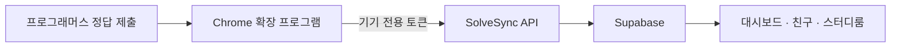

# SolveSync

> 푸는 순간 기록되고, 함께라서 꾸준해지는 알고리즘 스터디 플랫폼

SolveSync(솔브싱크)는 프로그래머스 풀이 기록을 자동으로 모으고, 친구와 스터디 멤버가 함께 목표를 이어갈 수 있도록 만든 서비스입니다.

문제를 풀 때마다 기록을 따로 옮길 필요가 없습니다. Chrome 확장 프로그램이 정답 제출을 감지해 풀이를 저장하고, SolveSync는 그 기록을 대시보드와 스터디 진행 현황에 바로 반영합니다.

**서비스 바로가기:** [solve-sync.vercel.app](https://solve-sync.vercel.app)

## 주요 기능

- **풀이 자동 기록** — 프로그래머스에서 정답을 제출하면 문제, 난이도, 언어, 풀이 시각과 소요 시간을 자동으로 저장합니다.
- **성장 대시보드** — 누적 풀이와 최근 활동, 기여 그래프로 알고리즘 학습 흐름을 확인합니다.
- **친구 연결** — 고유한 `@핸들`로 사용자를 찾고 친구 요청을 주고받습니다.
- **스터디룸** — 일간 또는 주간 목표와 최소 문제 난이도를 정하고 멤버별 달성 현황을 함께 확인합니다.
- **공개·비공개 스터디** — 누구나 참여하는 공개방과 비밀번호로 보호되는 비공개방을 만들 수 있습니다.
- **스터디 라운지** — 같은 스터디의 멤버들과 댓글을 남기고 실시간으로 대화합니다.

## 이용 방법

### 1. 계정 만들기

SolveSync에 접속해 **Google로 계속하기**를 누릅니다. 처음 로그인하면 친구 검색과 스터디 활동에 사용할 고유 핸들을 설정합니다.

핸들은 영문 소문자, 숫자, 밑줄을 사용해 3~20자로 만들 수 있습니다.

### 2. Chrome 확장 프로그램 설치하기

현재 확장 프로그램은 저장소의 `extension` 디렉터리에서 직접 설치합니다.

1. 이 저장소를 내려받거나 클론합니다.
2. Chrome 주소창에 `chrome://extensions`를 입력합니다.
3. 오른쪽 위의 **개발자 모드**를 켭니다.
4. **압축해제된 확장 프로그램을 로드합니다**를 누릅니다.
5. 저장소 안의 `extension` 디렉터리를 선택합니다.

설치가 끝나면 Chrome 도구 모음에 SolveSync 확장 프로그램을 고정해두면 편리합니다.

### 3. SolveSync 계정과 연결하기

1. Chrome에서 SolveSync 확장 프로그램을 엽니다.
2. **SolveSync 계정 연결**을 누르고 서버 통신 권한 요청을 허용합니다.
3. 열린 SolveSync 화면에서 Google로 로그인합니다.
4. 표시된 기기를 확인하고 **이 기기 연결 승인**을 누릅니다.
5. 연결 창이 닫히면 확장 프로그램에서 연결 상태를 확인합니다.

토큰을 복사하거나 붙여 넣을 필요가 없습니다. Windows 노트북, 데스크톱, Mac 등 각 기기에서 위 과정을 한 번씩 실행하면 모든 풀이가 같은 SolveSync 계정으로 모입니다. 기기마다 별도 토큰을 사용하므로 마이페이지에서 한 기기만 해제해도 다른 기기의 연결은 유지됩니다.

정답 기록은 서버 전송 전에 확장 프로그램의 로컬 대기열에 먼저 보관됩니다. 네트워크 또는 인증 문제로 즉시 전송하지 못한 기록은 자동으로 다시 전송되며, 확장 프로그램 팝업에서 대기 건수와 최근 오류를 확인하거나 **지금 동기화**를 실행할 수 있습니다.

### 4. 프로그래머스 문제 풀기

평소처럼 프로그래머스에서 문제를 풀고 코드를 제출합니다. 제출 결과가 정답이면 확장 프로그램이 풀이 정보를 SolveSync로 전송합니다.

첫 기록이 도착하면 대시보드의 확장 프로그램 상태가 **연동됨**으로 바뀌고, 이후 풀이가 자동으로 누적됩니다. 같은 문제를 다시 풀어도 한 문제는 하나의 기록으로 관리됩니다.

### 5. 친구와 함께하기

**친구** 메뉴에서 상대방의 핸들을 검색해 친구 요청을 보냅니다. 상대방이 요청을 수락하면 친구 목록에 연결됩니다.

### 6. 스터디룸 참여하기

**스터디** 메뉴에서 공개된 스터디룸을 둘러보거나 직접 새 방을 만듭니다.

- 목표 주기를 `매일` 또는 `매주`로 설정할 수 있습니다.
- 목표에 반영할 최소 문제 난이도를 `0단계 이상`부터 `5단계 이상`까지 설정할 수 있습니다.
- 비공개방은 8자 이상의 비밀번호로 보호됩니다.
- 스터디 멤버의 목표 달성 현황과 풀이 수를 함께 확인할 수 있습니다.
- 라운지에서 멤버들과 학습 상황이나 문제 풀이 이야기를 나눌 수 있습니다.

## 동작 방식



기기 연결 시 PKCE와 5분 유효 일회용 승인 코드를 사용하며, 장기 토큰은 URL에 노출하지 않습니다. 기기 전용 토큰은 원문 대신 SHA-256 해시로 저장합니다. 브라우저에서 사용하는 Supabase Publishable Key와 서버 전용 Secret Key를 분리하고, 사용자 데이터 접근은 PostgreSQL Row Level Security로 제한합니다.

## 로컬에서 실행하기

### 준비물

- Node.js 20 이상
- npm
- Supabase 프로젝트
- Google OAuth 클라이언트

### 1. 저장소 설치

```bash
git clone https://github.com/ggwanrok/solve-sync.git
cd solve-sync
npm install
```

### 2. Supabase 데이터베이스 구성

새 Supabase 프로젝트를 만든 뒤 Dashboard의 **SQL Editor**에서 `supabase/schema.sql` 전체를 실행합니다. 이 파일에는 테이블, 함수, 트리거, RLS 정책과 권한 설정이 포함되어 있습니다.

기존 데이터베이스를 업데이트하는 경우 다중 기기 연결을 위해 먼저 `supabase/extension-multi-device.sql`을 실행합니다. 익스텐션에서 문제 난이도를 저장하려면 `supabase/solve-event-difficulty.sql`을 실행합니다. 스터디룸 성능 개선을 적용하려면 `supabase/study-room-directory-pagination.sql`과 `supabase/study-room-detail-performance.sql`을 순서대로 실행한 뒤, 난이도 목표 기능을 위한 `supabase/study-difficulty-filter.sql`을 실행합니다. 그 밖의 필요한 기능 SQL을 적용한 다음 `supabase/security-hardening.sql`을 마지막에 실행합니다. 스터디 라운지 메시지를 실시간으로 동기화하려면 `supabase/study-comments-realtime.sql`을 실행합니다.

### 3. Google 로그인 구성

1. Supabase Dashboard의 **Authentication → Providers → Google**에서 Google 공급자를 활성화합니다.
2. Google OAuth Client ID와 Client Secret을 등록합니다.
3. Google Cloud Console의 승인된 리디렉션 URI에 다음 주소를 추가합니다.

```text
https://<your-project-ref>.supabase.co/auth/v1/callback
```

4. Supabase Authentication의 Redirect URLs에 로컬 콜백을 추가합니다.

```text
http://localhost:3000/auth/callback
```

배포 환경이 있다면 해당 서비스의 `/auth/callback` 주소도 함께 등록합니다.

### 4. 환경 변수 설정

루트에 `.env.local`을 만들고 다음 값을 입력합니다.

```env
NEXT_PUBLIC_SUPABASE_URL=https://<your-project-ref>.supabase.co
NEXT_PUBLIC_SUPABASE_PUBLISHABLE_KEY=sb_publishable_your-key
SUPABASE_SECRET_KEY=
SOLVESYNC_EXTENSION_IDS=
PRIVACY_CONTACT_EMAIL=privacy@example.com
```

`NEXT_PUBLIC_*` 변수는 브라우저에서 사용하는 공개 설정입니다. `SUPABASE_SECRET_KEY`, 데이터베이스 비밀번호, Google Client Secret에는 절대 `NEXT_PUBLIC_` 접두사를 붙이지 말고 Git에도 커밋하지 마세요. Chrome Web Store에 배포한 뒤에는 `SOLVESYNC_EXTENSION_IDS`에 확정된 확장 프로그램 ID를 입력합니다. 여러 ID는 쉼표로 구분하며, 압축해제 설치로 개발하는 동안에는 비워둘 수 있습니다. `PRIVACY_CONTACT_EMAIL`은 `/about` 개인정보 처리방침에 표시할 운영자 문의 주소입니다.

### 5. 개발 서버 실행

```bash
npm run dev
```

브라우저에서 [http://localhost:3000](http://localhost:3000)을 엽니다.

### 6. 확장 프로그램을 로컬 서버에 연결하기

기본 확장 프로그램은 배포된 SolveSync 서버를 사용합니다. 로컬 API와 연결하려면 다음 두 파일의 운영 주소를 `http://localhost:3000`으로 바꿉니다.

- `extension/config.js`의 `API_BASE`
- `extension/manifest.json`의 `optional_host_permissions`

변경 후 `chrome://extensions`에서 SolveSync 확장 프로그램을 새로고침합니다.

## 프로젝트 구조

```text
app/                     Next.js 페이지, Server Actions, Route Handlers
components/              화면 및 공통 UI 컴포넌트
extension/               프로그래머스 연동 Chrome 확장 프로그램
lib/                     인증·서버 조회·공통 유틸리티
public/                  아이콘과 정적 에셋
supabase/                데이터베이스 스키마와 기능별 SQL
utils/supabase/          브라우저·서버·Proxy용 Supabase 클라이언트
proxy.ts                 세션 갱신과 보호 페이지 접근 제어
```

## 기술 스택

- Next.js 16 · React 19 · TypeScript
- Tailwind CSS 4 · Base UI · shadcn/ui
- Supabase Auth · PostgreSQL · Row Level Security
- Chrome Extension Manifest V3
- Vercel Analytics

## 검증

```bash
npm run lint
npm test
npm run build
```
